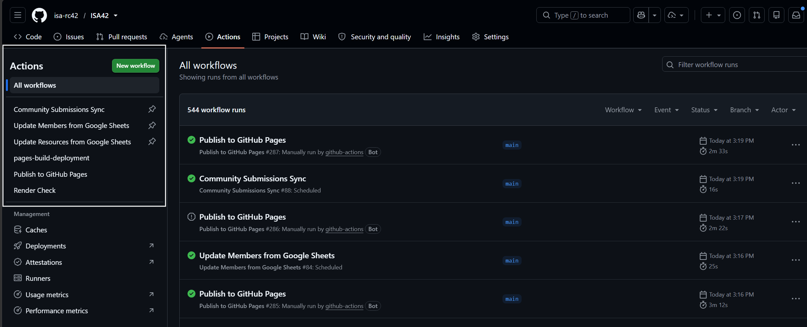

The website updates automatically on a scheduled basis, but administrators can also trigger immediate updates through GitHub Actions.

## Scheduled and on-demand updates

* **Daily automatic schedule:** The system updates automatically every day at 12:00 UTC (08:00–09:00 in Santiago / New York, 14:00 in Central Europe). Non-urgent edits can wait for this scheduled run.
* **On-demand updates:** If you approve an urgent announcement, fix a member profile, or add a time-sensitive call for papers, you can trigger an immediate update in GitHub Actions. The process takes approximately 90 seconds.

## Choosing the update workflow

| Content edited in Google Sheets | Workflow to select in GitHub Actions |
|:---|:---|
| News, events, calls for papers, community publications | `Community Submissions Sync` |
| Members Directory records or dates | `Update Members from Google Sheets` |
| Academic resources, handbooks, datasets | `Update Resources from Google Sheets` |

## Triggering an update manually

To run an update:

1. Go to `https://github.com/isa-rc42/ISA42`.
2. Select `Actions` in the top navigation bar.
3. In the left sidebar, select the workflow for the content you edited (such as `Community Submissions Sync`).
4. Click the `Run workflow` dropdown button on the right side of the page.
5. Verify that `Branch: main` is selected.
6. Click the green `Run workflow` button.

## Understanding workflow status indicators

After clicking `Run workflow`, a new entry appears at the top of the workflow runs list. The status indicator shows the progress:

* **In progress:** A yellow circle indicates that the automated process is currently reading the spreadsheet, validating data, and assembling the website. Wait 1 to 2 minutes for completion.
* **Successful:** A green check mark indicates that the process completed without errors and the website was published.
* **Failed:** A red X indicates that the process encountered an issue, such as a missing required column or an incorrectly formatted date.

If changes do not appear immediately on `https://isa-rc42.org`, your browser may be displaying a cached version. Perform a hard refresh using `Ctrl + F5` (Windows) or `Cmd + Shift + R` (Mac).

## Diagnosing a failed workflow run

If an update displays a red X:

1. Click on the title of the failed run in the Actions list.
2. In the left panel, click on the failed job name (such as `sync` or `update-members`).
3. Click on the step marked with an error indicator to inspect the error log.

### Common error messages and solutions

| Error message in log | Cause | Correction in Google Sheets |
|:---|:---|:---|
| `'Member ID' column not found` | A column header was deleted or renamed. | Open the spreadsheet and ensure the column is named exactly `Member ID`. |
| `Missing required field 'type'` | A submission is missing a required category. | Open the submissions sheet and fill in the missing cell. |
| `Date could not be parsed` | A date is not in `DD-MM-YYYY` format. | Correct the date cell in the active members spreadsheet. |
| `Failed to fetch data from sheet` | Google Sheets permission error. | Verify that the spreadsheet is shared with the RC42 service account. |

If the issue cannot be resolved through spreadsheet corrections, consult the [Troubleshooting guide](../troubleshooting.qmd) or contact a technical administrator.
